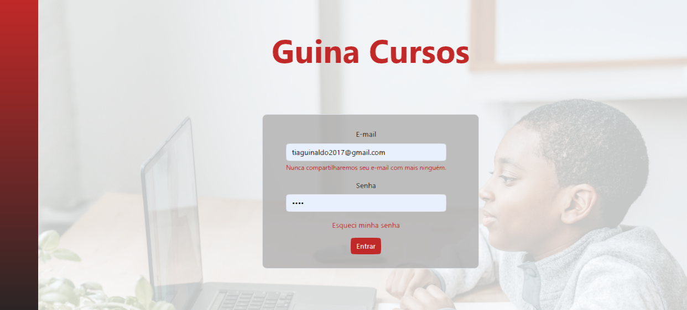
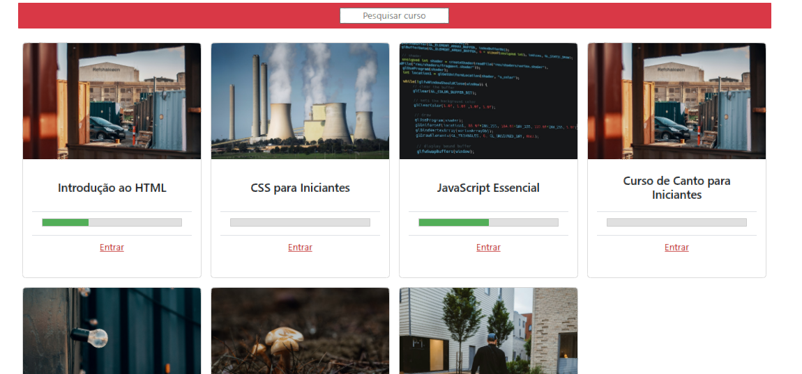

---

# Guina Cursos 📚💻

Bem-vindo ao Guina Cursos, uma plataforma de cursos online onde você pode aprender e ensinar!

## Descrição do Projeto

O Guina Cursos é um projeto desenvolvido em React.js que oferece uma plataforma para hospedar e assistir a cursos online. Ele permite que os usuários façam login, acessem o dashboard, visualizem cursos, adicionem novos cursos, editem seus perfis e participem das aulas.

## Instalação

1. Certifique-se de ter o Node.js e o npm instalados.
2. Clone este repositório: `git clone https://github.com/seu-usuario/guina-cursos.git`
3. Acesse o diretório do projeto: `cd guina-cursos`
4. Instale as dependências: `npm install`
5. Inicie o servidor de desenvolvimento: `npm start`

## Tecnologias Utilizadas

- React.js
- React Router DOM
- HTML
- CSS
- JavaScript

## Como Usar

1. Faça login na plataforma com seu e-mail e senha.
2. Acesse o dashboard para visualizar os cursos disponíveis.
3. Clique em um curso para ver mais detalhes.
4. Assista às aulas na sala de aula.
5. Adicione novos cursos pela página de adicionar curso.
6. Edite seu perfil na página de perfil.

## Estrutura do Projeto

- **`src/`**: Contém todo o código-fonte do projeto.
  - **`components/`**: Componentes reutilizáveis da aplicação.
  - **`views/`**: Páginas da aplicação.
  - **`assets/`**: Imagens e outros recursos estáticos.
  - **`Routes.js`**: Definição das rotas da aplicação.
  - **`App.js`**: Componente principal da aplicação.
  - **`index.js`**: Ponto de entrada da aplicação.
- **`public/`**: Contém arquivos públicos do projeto.

## Contribuindo

Contribuições são bem-vindas! Sinta-se à vontade para abrir um pull request ou criar uma issue se encontrar algum problema ou quiser sugerir uma melhoria.

## Autores

- [Seu Nome](https://github.com/seu-usuario)

## Licença

Este projeto está licenciado sob a [Licença MIT](LICENSE).

---
